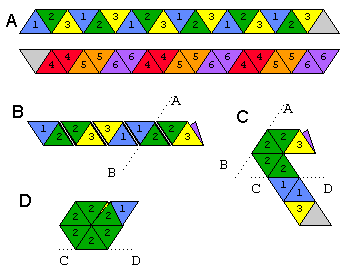

# hexaflexa

[hexaflexa](//github.com/michibo/hexaflexa) is a simple python program which
makes hexa-hexaflexagon PDF printouts, such that each face of the hexaflexagon
shows a different picture.

If you don't know what a hexaflexagon is, I recommend this great [series of
youtube videos by Victoria Hart](//youtu.be/VIVIegSt81k) ~~or this [website by
Alejandro Kapauan](http://home.xnet.com/~aak/hexahexa.html)~~ (Alejandro Kapauan
unfortunately disappeared from the internet. A copy of the content is below.) or
this [book by Martin
Gardner](http://www.cambridge.org/nl/academic/subjects/mathematics/recreational-mathematics/hexaflexagons-probability-paradoxes-and-tower-hanoi-martin-gardners-first-book-mathematical-puzzles-and-games?format=PB&isbn=9780521735254).

## How to install the program

To work with hexaflexa you need [poetry](https://python-poetry.org/).

Run

```sh
poetry install
```

## How to use the program

To run hexaflexa you need python and
[*pycairo*](https://cairographics.org/pycairo/).

Run

```sh
poetry shell
cd example
python ../src/hexaflexa.py --output 012345.pdf 0.png 1.png 2.png 3.png 4.png 5.png
```

You have to put in *six* different pictures or some faces will be empty. You can
put in up to *nine* different pictures. The last three pictures should be
watermark-images with given transparency values.

- The first three pictures will be printed on the *common* faces of the
  hexaflexagon,
- the next three pictures will be printed on the *hidden* faces,
- the (optional) last three pictures will be printed *over* the first three
  faces, but *twisted* and with a watermark/transparency effect. These *twisted*
  faces always appear (in their right orientation) after a hidden face, whereas
  the common faces will be twisted.

The program

- only works with *png* image files. Convert all images to png. (Use for
  instance the program
  [*convert*](https://www.imagemagick.org/script/index.php))
- You have to make sure that the images are more or less square shaped. If they
  are wider or higher the program crops out a square.
- Depending on the size of your images the pdf file can become very big. It can
  take long to open / print it. If you print on A4/letter paper 600x600 pixels
  for each picture should give a decent quality for the printout.
- Some pdf viewers/printers have problems with transparency in the pdf files
  generated by cairo. Try different viewers. The adobe viewer worked for me.

Pro-tip:

- Use the alpha channel/transparency feature of png-images to generate nice
  effects.

## How to actually make the hexaflexagon

~~To actually fold the hexaflexagon use for instance these
[instructions](http://home.xnet.com/~aak/hexahexa.html) for the
*hexahexaflexagon*.~~ These great instructions by Alejandro Kapauan
unfortunately disappeared from the internet. Below is a copy.

If you read German, you can also use these very [detailed
instructions](http://de.wikihow.com/Ein-Hexaflexagon-falten) with helpful
animations. Make sure to use the *Method 2* instructions for the bigger
**hexahexaflexagon** and not the instructions for the smaller
**trihexaflexagon**.

At first you need to cut out the four different *double strips* of the print
out. Next you fold the double strip in the middle and glue it together to get a
single strip that can be used to fold a hexahexaflexagon with one of the
instruction sets above. Every printout results in four hexaflexagon double
strips to save paper and trees.

If you find a bug, a problem with the instructions or have a comment: emails or
pull requests are always welcome :)

## Hexaflexagon instructions by Alejandro Kapauan

[Original website](http://home.xnet.com/~aak/hexahexa.html)

## Hexaflexagons

### Background

Hexaflexagons are paper hexagons folded from strips of paper which reveal
different faces as they are flexed. The Hexaflexagon described here has six
different faces, thus the name Hexahexaflexagon. An interesting chapter that
describes Hexaflexagons can be found in Martin Gardner's book Mathematical
Puzzles and Diversions, first published in 1959 by Simon and Schuster, and
reprinted in both hard-cover and paperback by several publishers including
Penguin Books (U.S., U.K. and Australia) and the Chicago Press. The book
consists mainly of Gardner's articles published in the Recreational Mathematics
column of Scientific American. Most public libraries in the United States either
have this book, or can borrow a copy for you from a neighboring library. It is
probably just as readily available in Europe and Asia. The copy I have was
printed in the UK, and purchased in the Philippines.

According to Martin Gardner's account, Hexaflexagons began in the fall of 1939
when Princeton University graduate student Arthur H. Stone from England trimmed
an inch from his American notebook sheets to fit his English binder. After
folding the trimmed-off strips for amusement, he came upon the first
Hexaflexagon, one that had three faces (now called a Trihexaflexagon). A
flexagon committee was organized including Bryant Tuckerman, Richard P. Feynman
and John W. Tukey. Larger structures were developed including the one variety of
hexahexaflexagon described here.

### How to Make a Hexahexaflexagon

The following diagram illustrates how to fold one variety of Hexahexaflexagon
from a straight strip of paper.



Cut a strip of paper and divide it into 19 equilateral triangles as shown in (A)
above. Number the triangles 1, 2, 3 on one side and 4, 5, 6 on the other. You
may also use six colors or other geometrical shapes or symbols to identify the
triangles. On the front side of the strip, the numbering pattern is 1, 2, 3, 1,
2, 3 etc., with the 19th triangle left blank. The blank triangle will be used to
glue the contraption shut at the end. On the back side of the strip, the
numbering pattern is 4, 4, 5, 5, 6, 6, etc. with the first triangle left blank.
The blank triangles are on opposite ends of the strip, on opposite sides. If
this is your first model, you might want to fold all of the edges both ways a
couple of times to make folding and flexing easier later.

Next, fold the strip so that the numbers on the back side face like numbers,
that is, 4 on 4, 5 on 5, 6 on 6. The result is shown in (B) above. In effect,
the strip has been folded into a flattened spiral.

Fold the strip back at line A-B, and then back at line C-D in Figure (C). On the
final fold at C-D, bring the tail end of the strip up in front of the head so
that the triangle numbered 3 faces the other triangle numbered 3. The result is
shown in (D). Finally, fold the last triangle flap over and glue the two blank
faces together. If you did it right, one face of the hexagon will have all
triangles numbered 1 and the other face all numbered 2.

The width of the original strip depends on how big you want the resulting
Hexahexaflexagon to be, and how thick the paper is to start with. Heavier paper
will require you to build bigger models for easier folding. For standard weight
copier or printer paper, a strip of about 2.5 to 5 cm. (1 to 2 inches) wide
should be okay. I use adding machine tape that is about 4 cm. wide. If you plan
on making more than a few models, I recommend purchasing a pack of adding
machine or cash register tape, and making a thin strip of metal or thin stiff
plastic the exact width of the tape. If you wind the tape around the strip, you
can quickly create the flattened spiral shown in Figure (B) above.

### How to Flex a Hexaflexagon

Start by pinching two triangles together along one of the edges. Push the outer
corner of the opposite two triangles inward. Then, open up the opposite two
triangles at the center to reveal an inner face of the Hexaflexagon. If they
refuse to open, try pinching an adjacent pair of triangles. In the
Hexahexaflexagon described here, if the model cannot open on one edge, it will
surely open on an adjacent edge. If the model was badly constructed, it may be
difficult to flex.

If you continue to flex the Hexaflexagon, it will eventually reveal all faces.
For this model, faces 1, 2 and 3 will appear more often than 4, 5 and 6.

### Applications

Besides being a very fascinating plaything for children of all ages,
Hexaflexagons have been used for greeting cards and promotional materials. You
can play tricks on some of your co-flexagators by gluing some faces together so
they can't get to them. Some faces of the Hexaflexagon appear in two ways, so
that a photograph cut and pasted on a face may sometimes appear correct, and
sometimes appear incorrect as the corners that once appeared at the center of
the hexagon now appear at the outer edge. If you are interested in other
Hexaflexagon models, Martin Gardner's book is the place to start.
